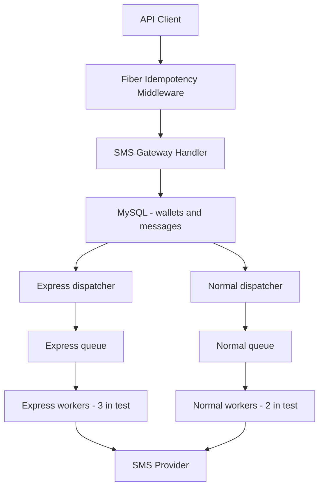
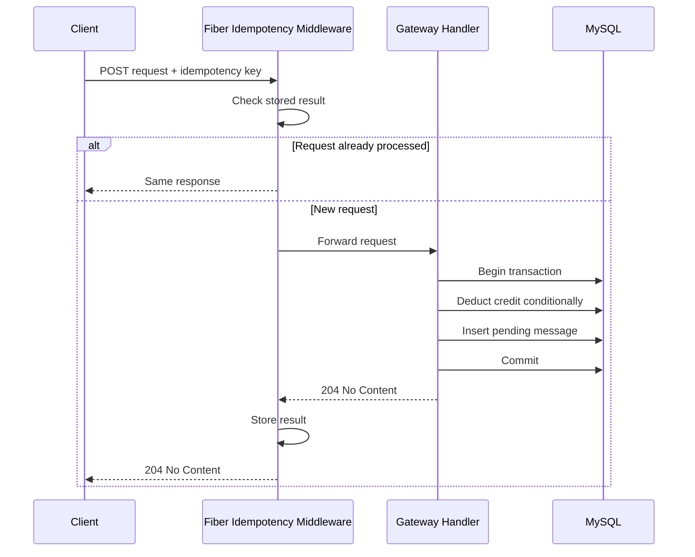
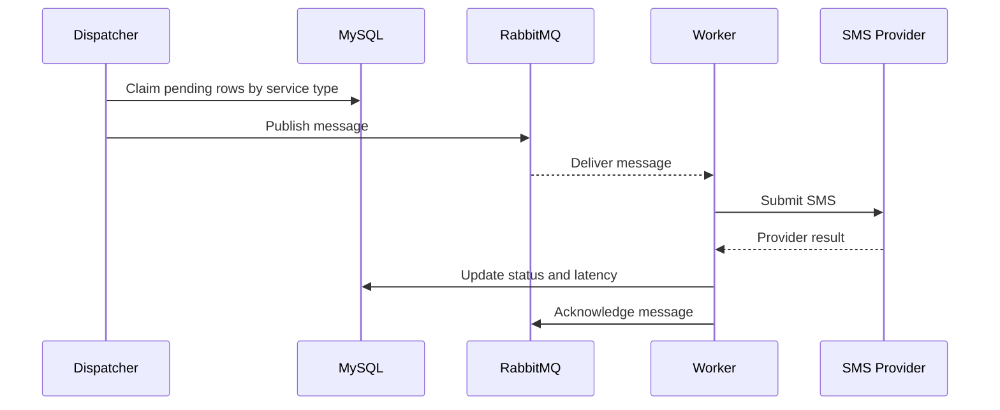
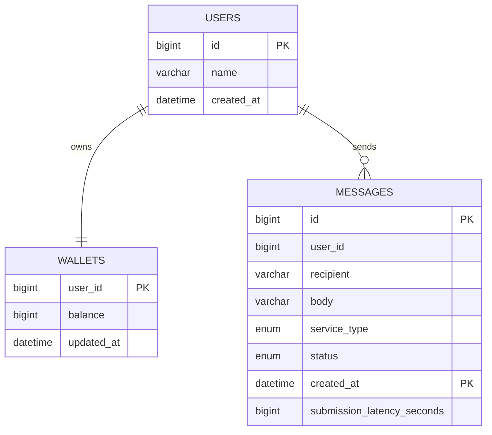

# SMS Gateway - Architecture and Performance

## 1. Problem Overview

The goal is to build a simple SMS Gateway that:

- accepts normal and express SMS requests through REST APIs;
- deducts one credit atomically from the user's prepaid wallet;
- rejects messages when the wallet has insufficient balance;
- submits accepted messages asynchronously to an SMS provider;
- gives express messages a faster, isolated delivery path;
- provides per-user message reports; and
- supports approximately 100 million messages per day.

Authentication, user management, and a graphical user interface are outside the challenge scope. All messages are treated as single-page messages with the same price.

The requested challenge deliverables are this architecture document and the implementation source code in the repository.

## 2. Capacity Estimate

The expected average request rate is:

```text
100,000,000 messages / 86,400 seconds = 1,157.4 requests/second
```

Average traffic does not represent short traffic spikes. For this implementation, the load-test target was rounded up to **2,000 RPS**, approximately **1.73x** the daily average:

| Service | Target rate | Duration | Expected requests |
| --- | ---: | ---: | ---: |
| Normal | 1,500 RPS | 60 seconds | 90,000 |
| Express | 500 RPS | 60 seconds | 30,000 |
| **Total** | **2,000 RPS** | **60 seconds** | **120,000** |

## 3. Load-Test Result

The test was executed with k6 using constant arrival rates.

| Metric | Result |
| --- | ---: |
| Completed requests | 119,922 |
| Achieved throughput | 1,997.81 RPS |
| Successful checks | 100% |
| HTTP failure rate | 0% |
| Average API latency | 42.66 ms |
| Normal p95 / p99 | 90.00 ms / 210.96 ms |
| Express p95 / p99 | 89.68 ms / 206.70 ms |

Both service types passed the API latency thresholds of `p95 < 200 ms` and `p99 < 500 ms`, and every executed request returned the expected `204 No Content` response.


### Provider Submission Snapshot

`submission_latency_seconds` measures the time from accepting a message until submitting it to the SMS provider.

| Service | Submitted | Minimum | Average | Maximum |
| --- | ---: | ---: | ---: | ---: |
| Normal | 89,938 | 9 s | 106.04 s | 214 s |
| Express | 29,984 | 2 s | 4.47 s | 9 s |

The submitted counts match the requests executed in this one-minute run.

The test used **three express workers** and **two normal workers**. The isolated express path kept provider-submission latency below 10 seconds, while normal traffic was processed with lower priority.

### 15-Minute Express Observation

The longer run confirmed stable express submission latency:

| Submitted | Minimum | Average | Maximum |
| ---: | ---: | ---: | ---: |
| 459,660 | 2 s | 4.51 s | 10 s |

This result measures submission to the SMS provider, not final handset delivery.

## 4. Current System Architecture

The current implementation uses **Fiber idempotency middleware**. Redis is not part of the deployed architecture.



### Main Flow

1. Fiber idempotency middleware validates `X-Idempotency-Key` and protects unsafe routes from duplicate processing.
2. In one MySQL transaction, it conditionally deducts one wallet credit and inserts a `pending` message.
3. The `messages` table also acts as an **inline transactional outbox**. The wallet debit and pending message are committed atomically, so the asynchronous publisher always has a durable record to process.
4. Two independent dispatcher jobs claim pending normal and express rows and publish them to separate RabbitMQ queues.
5. Workers consume the queues, submit messages to the SMS provider, and update message status and submission latency.

Express and normal dispatchers and workers can scale horizontally and independently. More express capacity can therefore be reserved without blocking normal traffic.

### Request Sequence



### Asynchronous Submission Sequence



## 5. Data Model

The implementation intentionally uses only three tables.




The `messages` table is partitioned daily by `created_at`. Date-bounded report
queries can use partition pruning. Reports use keyset pagination over ascending
message IDs instead of offset pagination, so later pages do not scan and discard
every earlier row. `p_future` is a safety partition. Automatic creation of
future partitions with MySQL Event Scheduler is planned as an operational
improvement.

`messages.user_id` is a logical relation to `users.id`. MySQL does not support foreign keys on this user-partitioned InnoDB table, so the application enforces the relation.

## 6. SMS Gateway API

Base URL:

```text
http://127.0.0.1:3000/api/v1/sms-gateway
```

| Method | Endpoint | Purpose | Success |
| --- | --- | --- | --- |
| `POST` | `/wallet/add` | Add wallet credit | `204` |
| `GET` | `/wallet/{user_id}` | Get wallet balance | `200` |
| `POST` | `/message/send` | Accept and charge for an SMS | `204` |
| `GET` | `/report?user_id={id}&from={date}&to={date}` | Get a paginated, date-bounded message report | `200` |

All current unsafe endpoints (`POST`) require a UUID-valued `X-Idempotency-Key`. Fiber idempotency middleware returns the previously stored result when the same key is retried.

For `/message/send`, `user_id` must be positive, `recipient` is required with at most 20 characters, `body` is required with at most 255 characters, and `service_type` must be `normal` or `express`. Each accepted message costs one wallet credit. Insufficient balance returns `409 Conflict`.

For `/report`, `user_id`, `from`, and `to` are query parameters. Dates use
`YYYY-MM-DD`, and the range is `from <= created_at < to`. Each page contains
up to 500 messages ordered by ascending message ID. To retrieve the next page,
clients pass the response's `last_seen` ID. The field is omitted when a page is
empty. Report statuses are `pending`, `processing`, `submitted`, and `failed`.

Complete curl requests and response examples are documented in [`API_EXAMPLES.md`](./API_EXAMPLES.md).

### Common Errors

| Status | Meaning |
| ---: | --- |
| `400` | Missing idempotency key, invalid body, report query, or pagination values |
| `404` | Wallet not found |
| `409` | Insufficient wallet balance |
| `500` | Internal server error |

## 7. Test Resource Limits

| Container | CPU limit | Memory limit |
| --- | ---: | ---: |
| MySQL | 4 cores | 2 GB |
| SMS Gateway API | 3 cores | 2 GB |
| Each worker | 1 core | 1 GB |
| RabbitMQ | 2.5 cores | 2 GB |

Five worker instances were used: three express and two normal.

## 8. Future Improvements

- Optionally add Redis as shared idempotency storage only if the SMS Gateway is later scaled to multiple API replicas. Redis is not used by the current implementation.
- Add a MySQL Event Scheduler job that creates future daily partitions and reorganizes `p_future` safely.
- Generate Swagger/OpenAPI documentation for all endpoints, validation rules, and response examples.
- Run longer mixed-workload soak tests and report provider-submission p95 and p99.

## 9. Technology Summary

| Component | Technology |
| --- | --- |
| API and jobs | Go |
| Primary storage | MySQL |
| Message broker | RabbitMQ |
| Idempotency | Fiber idempotency middleware |
| Load testing | k6 |
